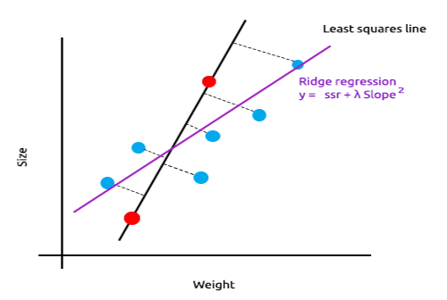
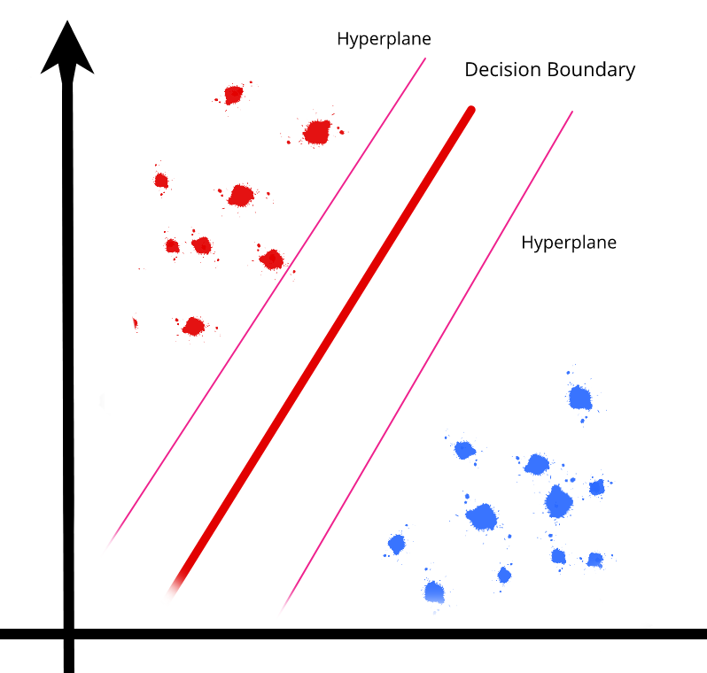
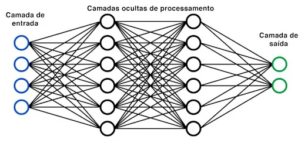
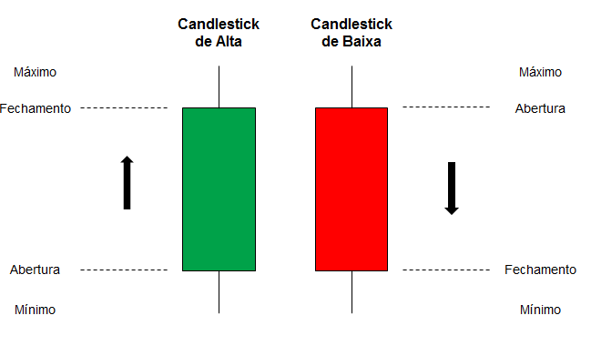
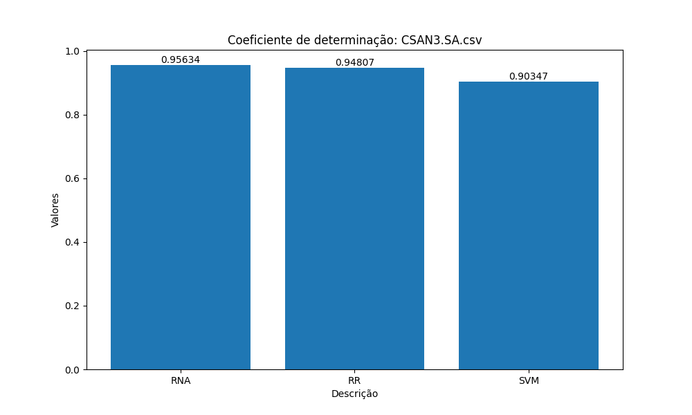
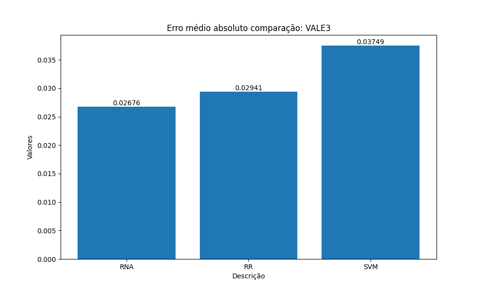
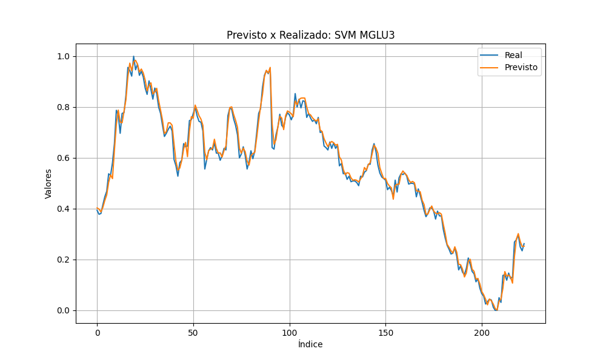
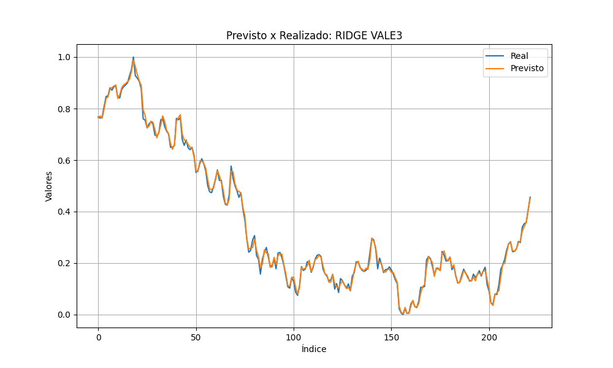
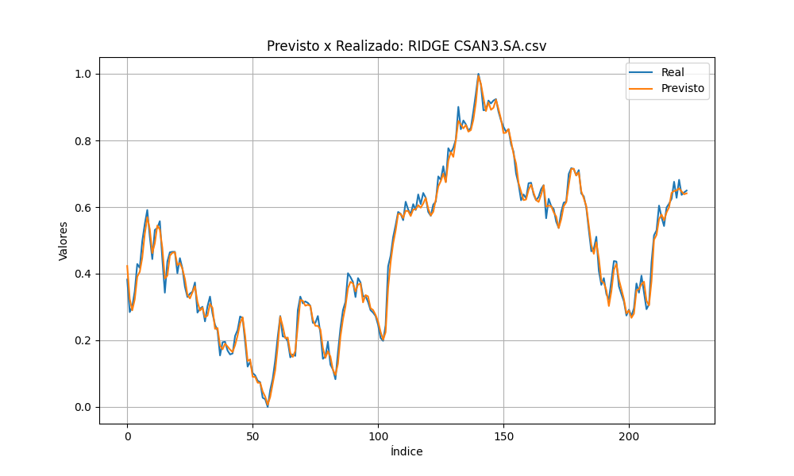
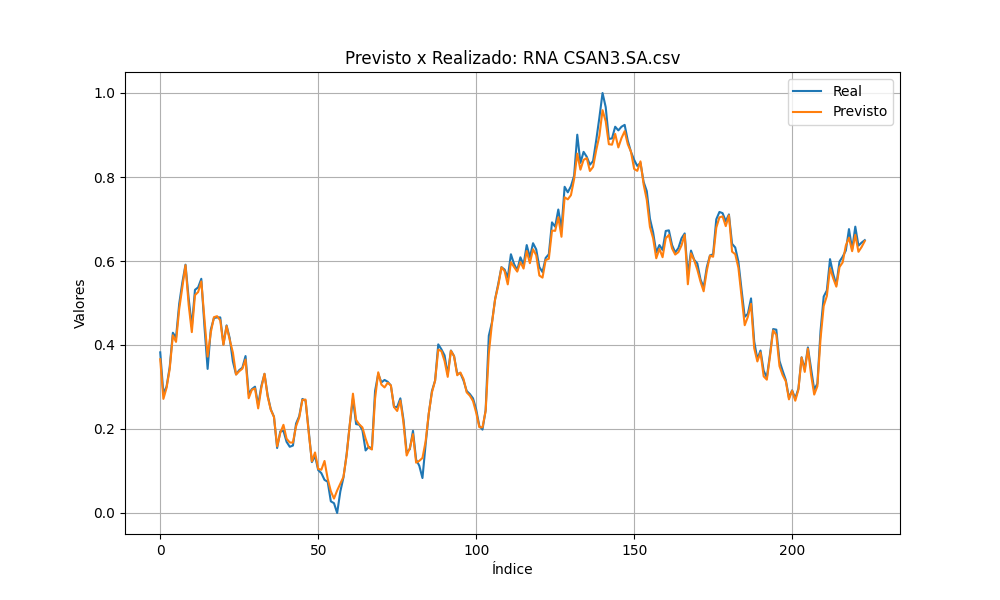

# Técnicas de aprendizado supervisionado para previsão da tendência do preço de ações na B3

**Autor:** Diego Dias Pereira  
**Instituição:** UFU  
**Data:** 11/02/2024

## Introdução
Esse trabalho consiste em aplicar técnicas de aprendizado supervisionado em dados das ações de empresas Brasileiras para tentar prever o preço dessa ação.

Prever os movimentos dos preços das ações é um desafio complexo pois envolvem muitas variáveis mensuráveis como taxa básica de juros, resultados da empresa, entre outros, e alguns imensuráveis como o emocional dos investidores, sentimento do mercado em relação a empresa. Devido isso a possibilidade de prever o preço de uma ação se torna relevante, para auxiliar os investidores a tomarem decisões mais assertivas.

## Objetivos e Desafios
Esse trabalho objetiva prever os preços das ações de três empresas brasileiras presentes na bolsa de valores Vale (VALE3), Cosan (CSAN3) e Magazine Luiza (MGLU3). Para isso, este estudo utiliza três algoritmos de machine learning support vector machines (SVM), redes neurais artificias (RNA) e Ridge Regression (RR).

Por fim são estipulados dados estatísticos para comparar a eficiência dos algoritmos

## Aspectos Teóricos
### Redes Neurais Artificias
- **Definição:** Uma rede neural é um modelo computacional inspirado na estrutura e no funcionamento do cérebro humano, composta por unidades de processamento chamadas neurônios.
- **Arquitetura Básica:** A estrutura fundamental de uma rede neural consiste em camadas de neurônios interconectados, incluindo uma camada de entrada, uma ou mais camadas ocultas e uma camada de saída.
- **Neurônios:** Os neurônios são unidades de processamento que recebem entradas ponderadas, aplicam uma função de ativação e produzem uma saída. A interconexão de neurônios forma as conexões sinápticas da rede.
- **Treinamento:** O processo de treinamento de uma rede neural envolve o ajuste dos pesos das conexões sinápticas para minimizar uma função de perda, geralmente usando algoritmos como retropropagação.

### Support Vector Machines
- **Definição:** Support Vector Machines (Máquinas de Vetores de Suporte) são um conjunto de algoritmos de aprendizado supervisionado usados para classificação e regressão.
- **Princípio Básico:** SVM busca encontrar o hiperplano de decisão que melhor separa as classes no espaço de características, maximizando a margem entre as classes.
- **Vetores de Suporte:** Os vetores de suporte são os pontos de dados mais próximos ao hiperplano de decisão e desempenham um papel crucial na definição da margem.
- **Núcleos:** SVM pode usar funções de kernel para mapear dados para um espaço de características de maior dimensão, permitindo a separação de classes não linearmente separáveis.
- **Regularização:** A regularização em SVM é controlada pelo parâmetro C, que equilibra a busca por uma margem mais ampla com a classificação correta dos pontos de treinamento.
- **Vantagens:** SVMs são eficazes em espaços de alta dimensão, robustos contra overfitting e versáteis devido à escolha de diferentes funções de kernel.

### Ridge Regression
- **Definição:** Ridge Regression, também conhecida como Regressão de Crista, é uma técnica de regularização utilizada em problemas de regressão linear para lidar com a multicolinearidade.
- **Objetivo:** O principal objetivo da Ridge Regression é impedir a ocorrência de coeficientes de regressão muito grandes, penalizando-os através da adição de um termo de regularização à função de perda.
- **Função de Custo:** A função de custo em Ridge Regression inclui um termo de regularização L2, que é proporcional ao quadrado da norma euclidiana dos coeficientes de regressão. Isso ajuda a evitar overfitting.
- **Parâmetro de Regularização (\(\lambda\)):** O sucesso da Ridge Regression depende da escolha adequada do parâmetro de regularização (\(\lambda\)), que controla a força da penalização. Cross-validation é frequentemente usado para encontrar o valor ótimo de \(\lambda\).

## Visualização dos algoritmos

Ridge Regression

SVM

Redes Neurais

## Ferramentas Utilizadas
Os algoritmos citados foram implementados por meio da linguagem Python com auxílio de algumas bibliotecas disponíveis na extensa comunidade da linguagem. As bibliotecas são:
- Pandas
- NumPy
- Scikit-Learn
- Keras
- Tensorflow
- Matplotlib

## Metodologia
Os dados das ações foram obtidos através do Yahoo Finance contendo os valores de abertura, máximo, mínimo, fechamento e volume de determinada ação em uma frequência diária. Esses valores são normalmente plotados nos chamados gráfico de candlesticks.

## Pré Processamento dos Dados
Após a coleta dos dados precisamos efetuar alguns pré processamentos nos dados para se adequarem aos nossos testes.
- É adicionado uma coluna de target se referindo ao valor de fechamento da linha posterior que é o que queremos que os nossos algoritmos propostos tentem prever.
- Os dados são normalizados utilizando a técnica chamada Min-Max Scaler.
- É removida a última linha dos registros pois ela não estará rotulada.
- Para treinamento foram obtidos todos os dados da ação antes de 01/01/2023 e para os testes foram utilizados os dados depois de 01/01/2023.

## Estrutura da Rede Neural Artificial
Foi desenvolvida uma RNA com 1 camada de entrada, 2 camadas ocultas e 1 camada de saída. A camada de entrada e a primeira camada oculta possuem 12 neurônios, a segunda camada oculta possui 3 neurônios, já a camada de saída possui 1 neurônio. A função de ativação empregada nas células foi a Rectified Linear Unit (ReLU). A rede neural foi compilada utilizando o otimizador Adam e função de perda de Erro Quadrático Médio.

## Resultados
### Coeficiente de Determinação

### Erro médio absoluto

### Erro quadrático médio

### Previsto x Realizado

#### SVM

#### Ridge Regression

#### Redes Neurais

## Comparação

Na analise técnica é muito comum a operação de compra e venda
de ações serem sustentadas por meio de indicadores que os
investidores utilizam dentre eles temos médias móveis, estocástico e
entre outros. Muita das vezes esses indicadores tem como base os
dados anteriores da ação e por isso indicam também a possível
tendência daquela ação. Em um trabalho anterior [1] fiz a analise
dos investimentos baseado em um desses indicadores e nesse
trabalho foi possível obter apenas 36,49% de acurácia.

## Conclusão
Com esse trabalho foi possível obter dados relevantes de, como
técnicas de aprendizado supervisionado performam diante de um
problema de regressão. Foi possível identificar que os 3 algoritmos
conseguem boas métricas, com destaque para a Rede Neural
Artificial (RNA) proposta que teve os melhores resultados médios
comparado ao Ridge Regression (RR) e Support Vector Machines
(SVM).

## Referências
- Pereira, Diego Dias, Jean Lucas de Sousa. "Análise computacional de estratégias para o mercado financeiro." (2019).
- Santos, Gustavo Carvalho. "Algoritmos de machine learning para previsao de açoes da B3." (2020).
- Danilofneto, "Prevendo valores de ações usando Machine Learning e Deep Learning." Disponível em: [link](https://danilofelipeneto.medium.com/prevendo-valores-de-ações-usando-machine-learning-e-deep-learning-80216e55e582). Acesso em: 25 de nov. de 2023.
